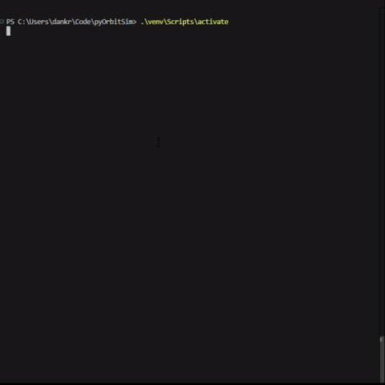
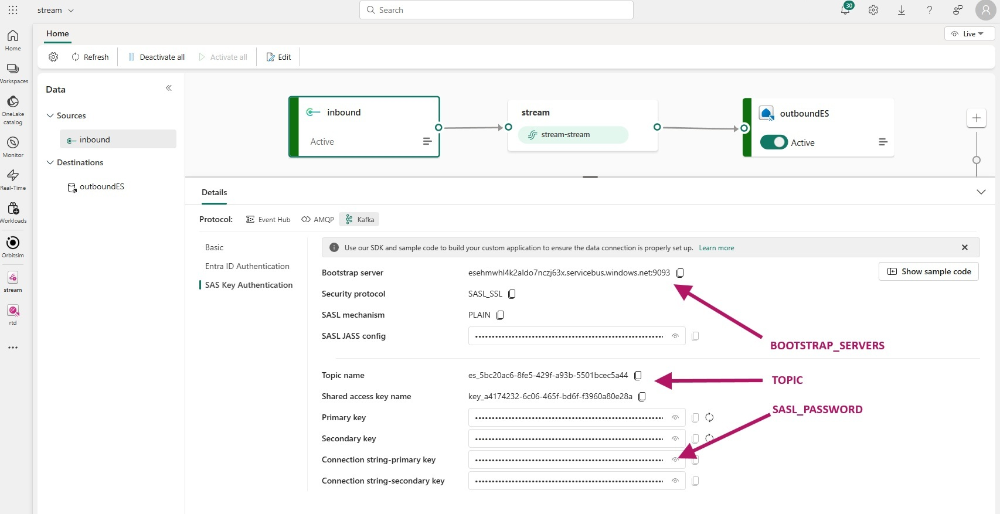

# 🛰️ Kafka Satellite Producer Dashboard

A terminal-based Kafka producer that simulates real-time satellite telemetry, visualizes delivery metrics, and lets you interact via keyboard input. Built with Python, [Rich](https://github.com/Textualize/rich), `confluent_kafka`, and ChatGPT.

I just needed a nice data generator app for some fun 3D data visualization stuff I'm working on.



---

## ✨ Features

- 📡 Simulates configurable number of satellites sending positional and telemetry data - add or remove satellites on the fly
- 📈 Live delivery stats with sparkline for latency  
- 🎨 Terminal UI with `rich`  
- ⌨️ Keyboard controls for interactive use  
- 🔐 Secure Kafka connection using Event Streams on Microsoft Fabric  

---

## 🛠 Requirements

- Python 3.8+
- `confluent_kafka`
- `rich`
- `keyboard`
- `python-dotenv`
- A Microsoft Fabric EventStream Kafka endpoint

---

## 🚀 Quick Start

1. **Install dependencies**

    ```bash
    pip install -r requirements.txt
    ```

2. **Create a `.env` file**

    ```env
    BOOTSTRAP_SERVERS=your-namespace.servicebus.windows.net:9093
    SASL_USERNAME=$ConnectionString
    SASL_PASSWORD=Endpoint=sb://...;SharedAccessKeyName=...;SharedAccessKey=...;EntityPath=...
    TOPIC=es_your_eventstream_topic
    ```
    
    (SASL_USERNAME must be hardcoded to ```$ConnectionString```)

3. **Run the simulator**

    ```bash
    python main.py
    ```

---

## ⌨️ Controls

| Key         | Action                                     |
|-------------|--------------------------------------------|
| `L`         | Launch (create) new satellite              |
| `C`         | Crash (remove) randomly selected satellite |
| `N`         | Display next system message                |
| `P`         | Display previous system message            |
| `Esc`       | Quit gracefully                            |
| `Spacebar`  | Add a system message                       |

---

